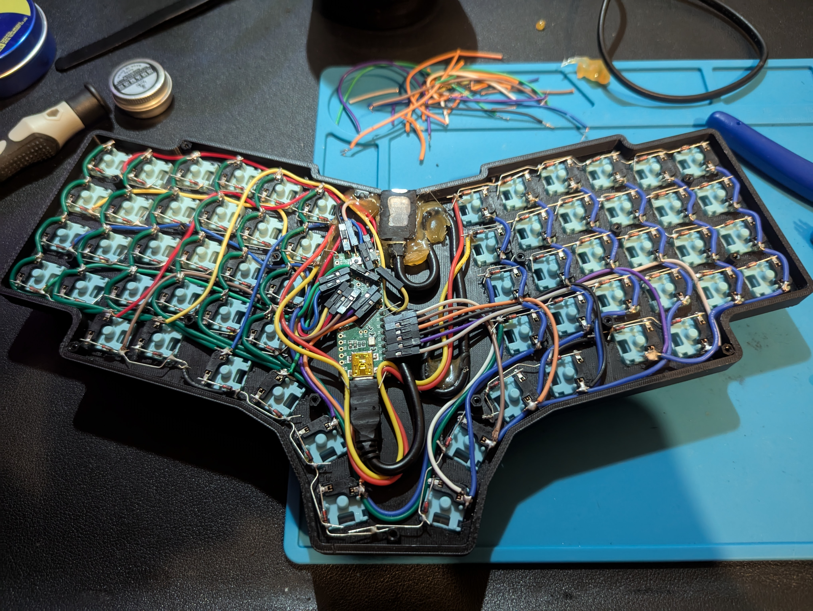
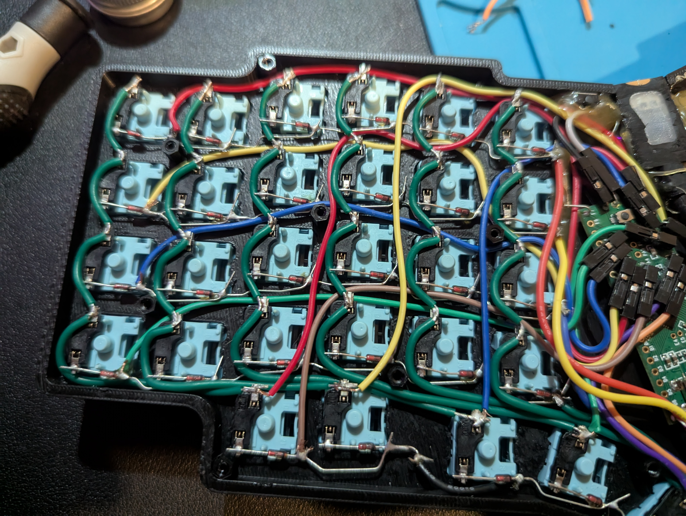
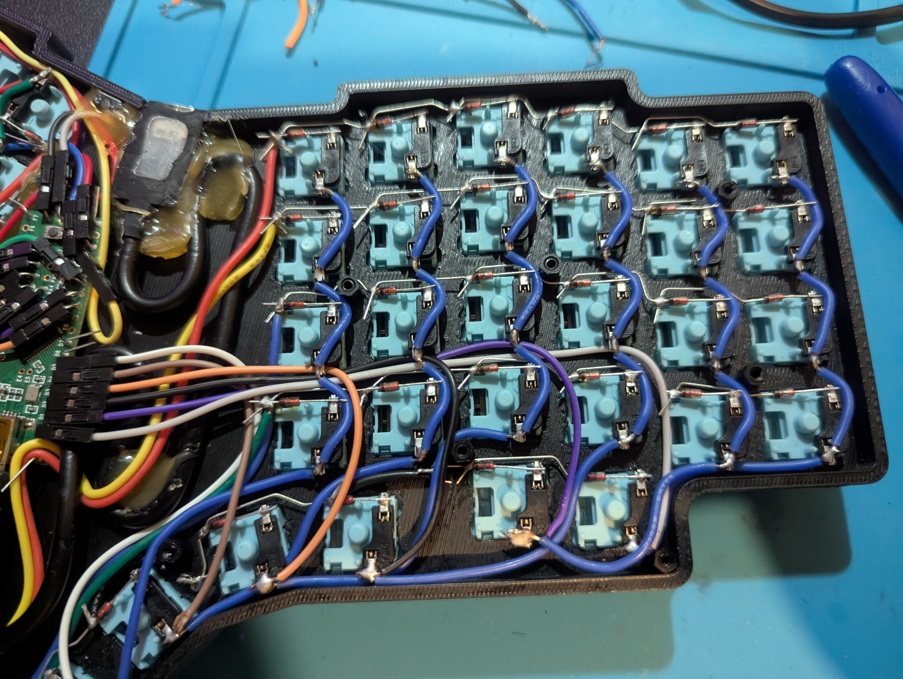
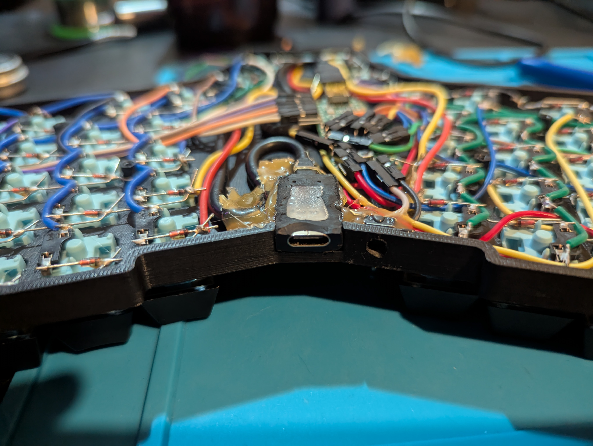
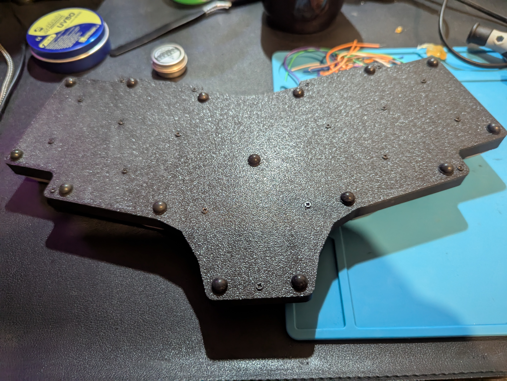
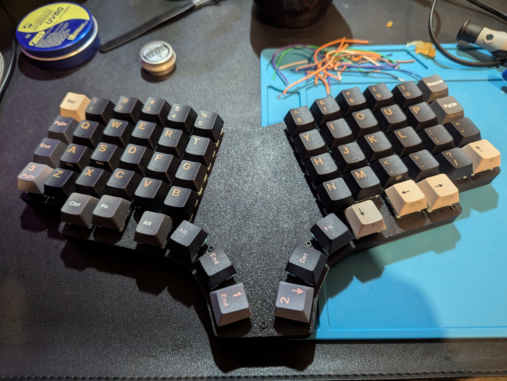
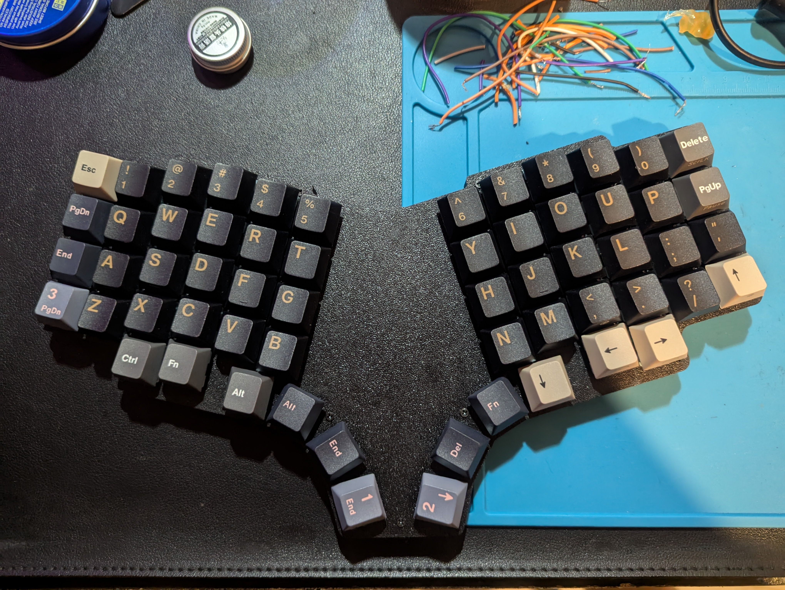
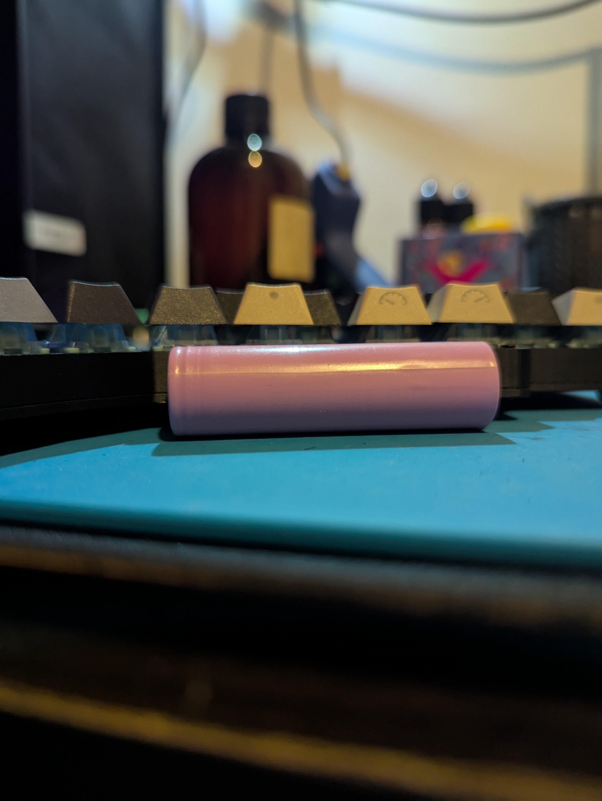

# Spender

Inspiration from [Pteron](https://github.com/FSund/pteron-keyboard)

Refer STLs and Drawing (dxf or svg format) in STL folder

To view the whole case: [viewstl](https://www.viewstl.com/)

## Hardware

1. Teensy++ 2.0 with (AT90USB1286)

## Getting Started

`keymaps_spender.json` is a JSON representation of current configuration. This file need to be converted to C file and compile to `hex` before can be flash.

### Guide

This guide assumed you are already follow root `README.md`, specifically these:

1. Setup QMK and clone the repository
2. Setup VS Code for C development
3. Create symbolic link between this repository and QMK/Vial repository

The keyboard will be working is in this directory `<path-to-qmk-repository>/keyboards/saifymatteo/spender/firmware`.

Copy `keymaps_spender.json` to `<path-to-qmk-repository>` folder and run next command to convert

To convert keymap from JSON to C file, use this:

```bash
qmk json2c keymaps_spender.json >> keyboards/saifymatteo/spender/firmware/keymaps/vial/keymap.c
```

Ensure key maps are valid in `spender/keymaps/vial/keymap.c`

Now we can compile to flash

To compile keyboard and keymap:

```bash
qmk compile -kb saifymatteo/spender/firmware -km vial
```

Note:

- `-kb` is `saifymatteo/spender/firmware` keyboard config
- `-km` is `vial` keyboard mapping

### Flashing

To flash, use QMK Toolbox.

Set local file to `\saifymatteo_spender_firmware_vial.hex` and MCU to `AT90USB1286`

Start flashing by shorting RST and GND pin or press the reset switch on the back.

Once done, quickly press Flash

If need to clear EEPROM, double press reset switch and press Clear EEPROM

## VIAL

Alternative to remap your keymap, no need to reflash everytime want to change keymap.

Clone [vial-qmk](https://github.com/vial-kb/vial-qmk) to get started.

Creating the flash file for VIAL enabled are similar with QMK, the difference is that VIAL use `make` instead `qmk compile`

Ensure working directory in `vial-qmk` directory.

Run this to compile to `hex` file

```bash
make saifymatteo/spender/firmware:vial
```

### VIAL Flashing

Please see [QMK flashing](#flashing)

## Images

<details>
<summary>Solder full view</summary>

</details>
<details>
<summary>Solder center view</summary>

</details>
<details>
<summary>Solder right side view</summary>

</details>
<details>
<summary>Solder left side view</summary>

</details>
<details>
<summary>Solder usb port</summary>

</details>
<details>
<summary>Back plate with rubber feet</summary>

</details>
<details>
<summary>Front view with keycaps #1</summary>

</details>
<details>
<summary>Front view with keycaps #2</summary>

</details>
<details>
<summary>Comparison keyboard height with 18650 battery</summary>

</details>
