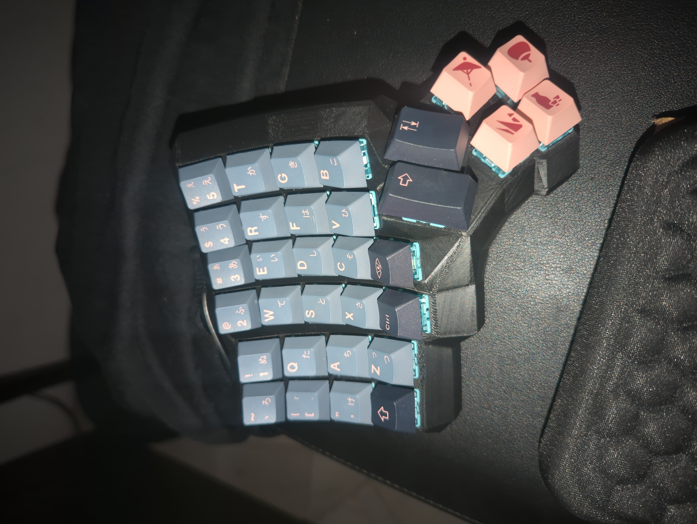
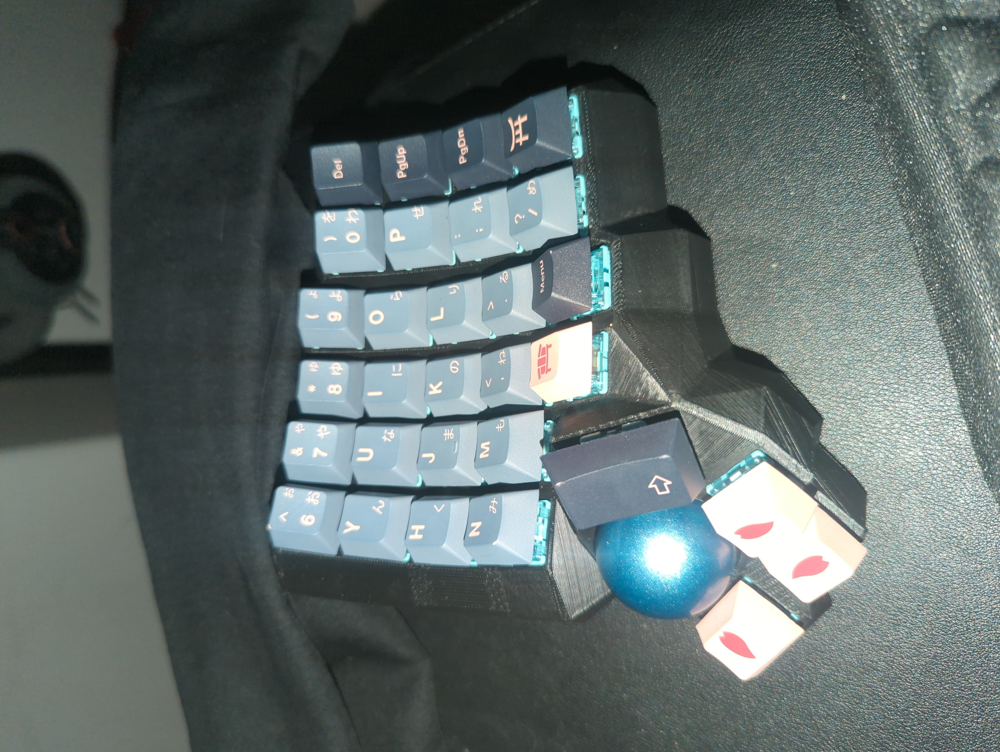
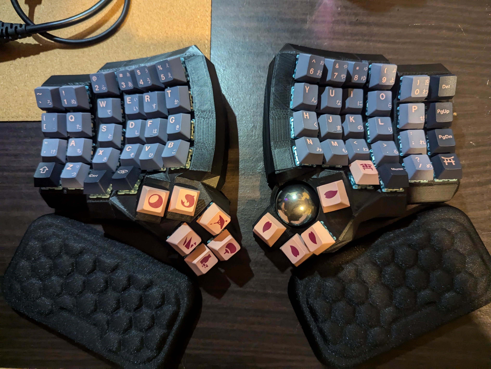
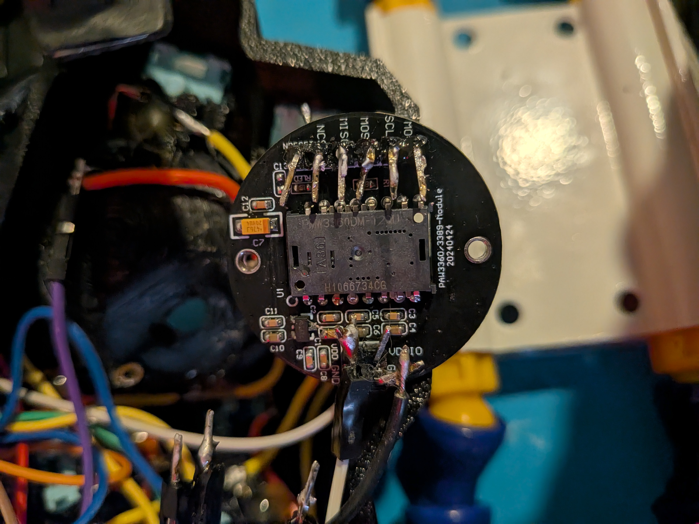
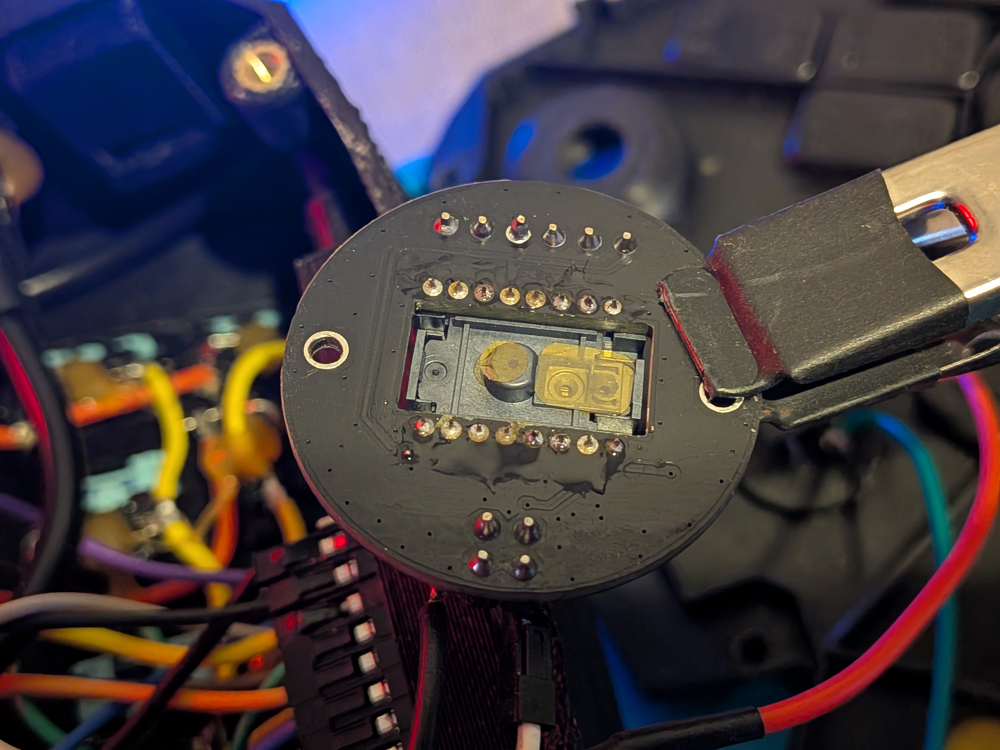
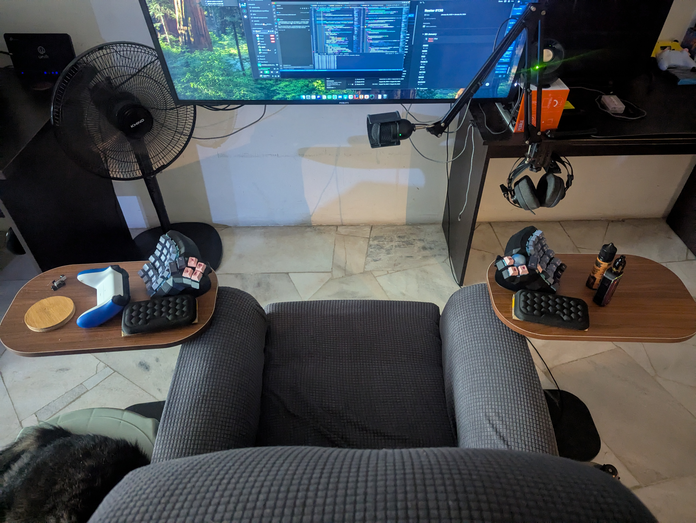

# Tractyl Manuster

Inspiration from [Schievel1](https://github.com/Schievel1/dactyl_manuform_r_track) and [noahprince22](https://github.com/noahprince22/tractyl-manuform-keyboard)

Use these STL files from u/Tonehaven2 instead:

- [left](https://gitlab.com/keyboards1/dm_left/-/blob/master/boolean/left.stl)
- [right](https://gitlab.com/keyboards1/dm_r_track/-/blob/master/boolean/right.stl)

To view the whole case: [viewstl](https://www.viewstl.com/)

## Hardware

1. Pro Micro 2x for both left and right (deprecated).
    1. On the trackball side, we will use pretty much all of the pin
    2. This is for only USB C Pro Micro
2. RP2040 2x for both left and right.

## Getting Started

`keymaps_tractyl_manuform.json` is a JSON representation of current configuration. This file need to be converted to C file and compile to `hex` before can be flash.

<details>

<summary>AVR Pro Micro MCU</summary>

> Refer `promicro/KBPinouts.png` for right side pin layout and `promicro/wiring_left.png` for left. Both wiring are similar, so can refer left side.

</details>

<details>

<summary>Generic RP2040</summary>

> Refer `rp2040/tractyl_rp2040_pinout.pdf` for both left and right side pin layout.

</details>

### Guide

This guide assumed you are already follow root `README.md`, specifically these:

1. Setup QMK and clone the repository
2. Setup VS Code for C development
3. Create symbolic link between this repository and QMK/Vial repository

The keyboard will be working on is in this directory `<path-to-qmk-repository>/keyboards/saifymatteo/tractyl_manuster/firmware`, with difference based on your MCU:

- `promicro` and `keymaps/vial_promicro`
- `rp2040` and `keymaps/vial_rp2040`

#### Convert JSON Keymap to `keymap.c`

Copy `keymaps_tractyl_manuform.json` to `<path-to-qmk-repository>` folder and run next command to convert

To convert keymap from JSON to C file, use this:

```bash
# for AVR Pro Micro
qmk json2c keymaps_tractyl_manuform.json >> keyboards/saifymatteo/tractyl_manuster/firmware/keymaps/vial_promicro/keymap.c

# for RP2040
qmk json2c keymaps_tractyl_manuform.json >> keyboards/saifymatteo/tractyl_manuster/firmware/keymaps/vial_rp2040/keymap.c
```

Ensure key maps are valid in the generated `keymap.c`

Now we can compile to flash.

### Compiles

To compile keyboard and keymap:

```bash
# for AVR Pro Micro
qmk compile -kb saifymatteo/tractyl_manuster/firmware/promicro -km vial_promicro

# for RP2040
qmk compile -kb saifymatteo/tractyl_manuster/firmware/rp2040 -km vial_rp2040
```

Note:

- `-kb` is `saifymatteo/tractyl_manuster/firmware/promicro` keyboard config
- `-km` is `vial_promicro` keyboard mapping

### Flashing

To flash, use QMK Toolbox (for AVR) or drag-and-drop (for RP2040).

To flash, choose based on your MCU:

<details>

<summary>AVR Pro Micro MCU</summary>

> Set local file to `saifymatteo_tractyl_manuster_firmware_vial_promicro.hex` and MCU to `ATmega32U4`.
>
> Start flashing by shorting RST and GND pin or press the reset switch on the back.
>
> Once done, quickly press Flash.
>
> If need to clear EEPROM, double press reset switch and press Clear EEPROM.

</details>

<details>

<summary>Generic RP2040</summary>

> Refer `rp2040/tractyl_rp2040_pinout.pdf` for both left and right side pin layout.
>
> Start flashing by shorting RUN and GND pin 2 times.
>
> Once done, you can proceed to use drag-and-drop the `saifymatteo_tractyl_manuster_firmware_rp2040_vial_rp2040.uf2` file to the RP2040 drive.

</details>

Note:

- You need to flash both side with the same `hex` or `.uf2` file
- Communication between each side will be automatic once flashed

## VIAL

Alternative to remap your keymap, no need to reflash everytime want to change keymap.

Clone [vial-qmk](https://github.com/vial-kb/vial-qmk) to get started.

Creating the flash file for VIAL enabled are similar with QMK, the difference is that VIAL use `make` instead `qmk compile`

Ensure working directory in `vial-qmk` directory.

Run this to compile to `hex` or `.uf2` file

```bash
# for AVR Pro Micro
make saifymatteo/tractyl_manuster/firmware/promicro:vial_promicro

# for RP2040
make saifymatteo/tractyl_manuster/firmware/rp2040:vial_rp2040
```

### VIAL Flashing

Please see [QMK flashing](#flashing)

## Images








## Other sources

- Trackball Small | [Tractyl ManuForm Keyboard](https://github.com/noahprince22/tractyl-manuform-keyboard)
- Non-trackball | [Complete idiot guide for building a dactyl manuform keyboard](https://medium.com/swlh/complete-idiot-guide-for-building-a-dactyl-manuform-keyboard-53454845b065)
- Trackball RGB | [Track Beast build log: a trackball Dactyl-manuform](https://medium.com/@kincade/track-beast-build-log-a-trackball-dactyl-manuform-19eaa0880222)
- Non-trackball Wireless | [I Built A Wireless Dactyl Manuform](https://tuxtower.net/blog/dactylmanuform/)
- Trackball No Build Guide | [u/Tonehaven2](https://www.reddit.com/r/ErgoMechKeyboards/comments/l5n0ab/trackball_in_a_dactyl_manuform_5x6_by_uqqurn/)
