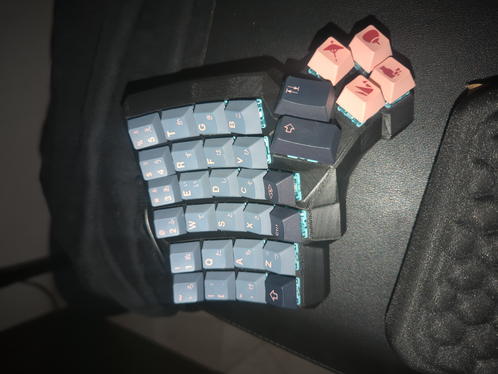
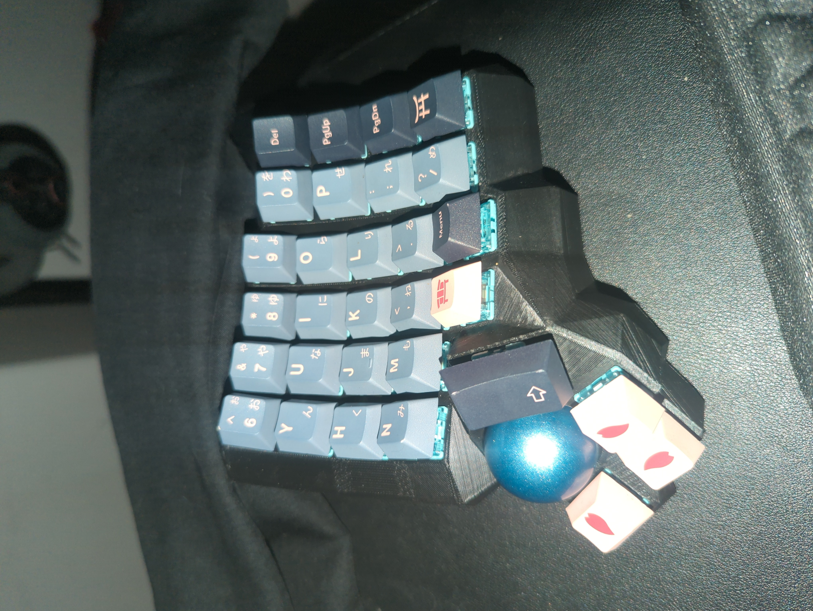
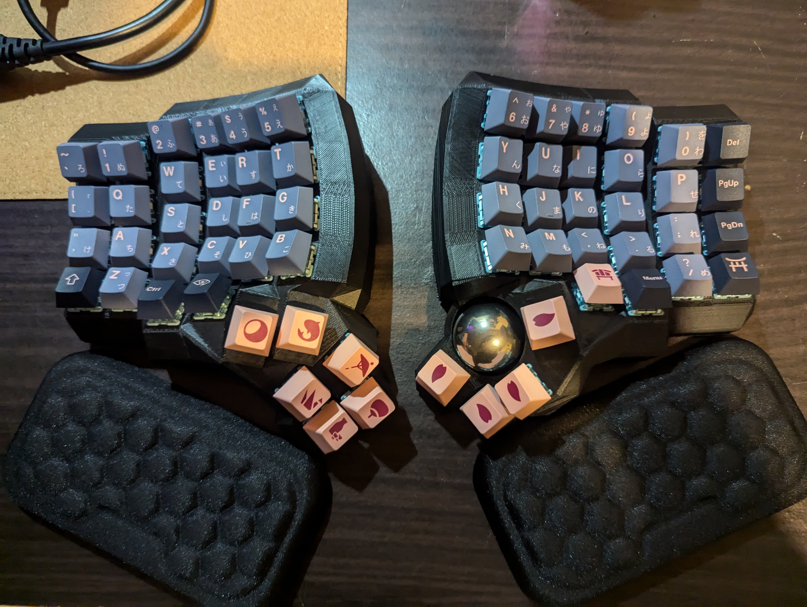
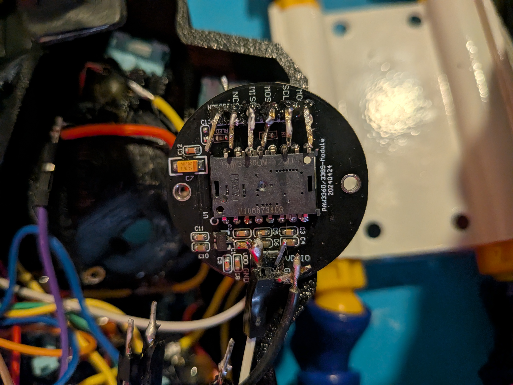
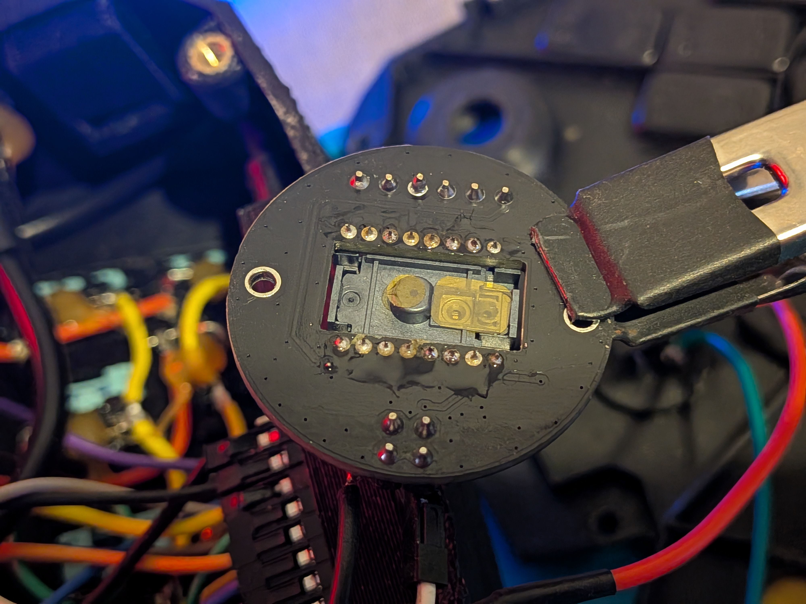
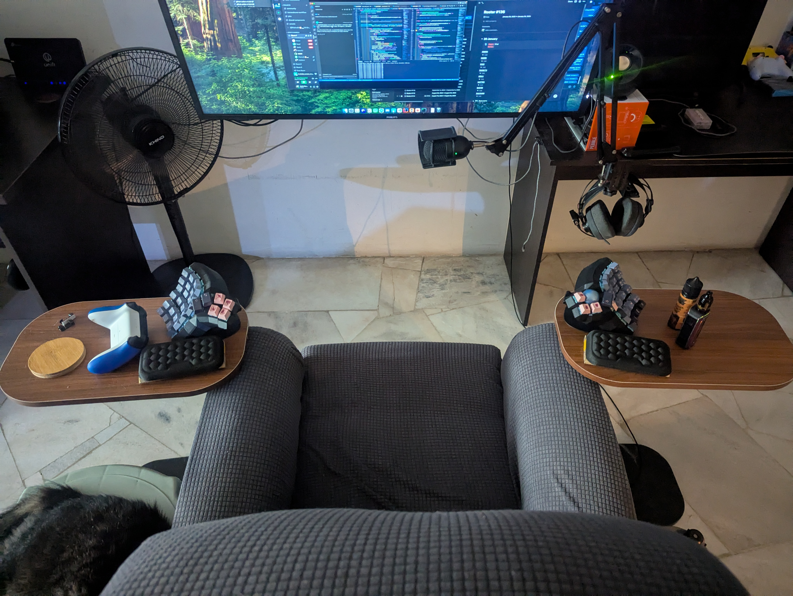

# Tractyl Manuster

Inspiration from [Schievel1](https://github.com/Schievel1/dactyl_manuform_r_track) and [noahprince22](https://github.com/noahprince22/tractyl-manuform-keyboard)

Use these STL files from u/Tonehaven2 instead:

- [left](https://gitlab.com/keyboards1/dm_left/-/blob/master/boolean/left.stl)
- [right](https://gitlab.com/keyboards1/dm_r_track/-/blob/master/boolean/right.stl)

To view the whole case: [viewstl](https://www.viewstl.com/)

## Hardware

1. RP2040
2. PWM3360 Sensor
3. EC11 Rotary Encoder
4. OLED 128x36 i2C
5. Passive Piezo Buzzer
6. Coin Vibration Motor

## Getting Started

Refer `tractyl_rp2040_pinout.pdf` for both left and right side pin layout.

### Guide

This guide assumed you are already follow root `README.md`, specifically these:

1. Setup QMK and clone the repository
2. Setup VS Code for C development
3. Create symbolic link between this repository and QMK/Vial repository

The keyboard will be working on is in this directory `<path-to-qmk-repository>/keyboards/saifymatteo/tractyl_manuster/firmware`, with difference based on your MCU:

### Compiles

To compile keyboard and keymap:

```bash
qmk compile -kb saifymatteo/tractyl_manuster/firmware -km vial
```

Note:

- `-kb` is `saifymatteo/tractyl_manuster/firmware` keyboard config
- `-km` is `vial` keyboard mapping

### Flashing

To flash, simply drag-and-drop for RP2040.

Start flashing by shorting RUN and GND pin 2 times.

Once done, you can proceed to use drag-and-drop the `saifymatteo_tractyl_manuster_firmware_vial.uf2` file to the RP2040 drive.

Note:

- You need to flash both side with the same `.uf2` file
- Communication between each side will be automatic once flashed

## VIAL

Alternative to remap your keymap, no need to reflash everytime want to change keymap.

Clone [vial-qmk](https://github.com/vial-kb/vial-qmk) to get started.

Creating the flash file for VIAL enabled are similar with QMK, the difference is that VIAL use `make` instead `qmk compile`

Ensure working directory in `vial-qmk` directory.

Run this to compile to `.uf2` file

```bash
make saifymatteo/tractyl_manuster/firmware:vial
```

### VIAL Flashing

Please see [QMK flashing](#flashing)

## Other sources

- Trackball Small | [Tractyl ManuForm Keyboard](https://github.com/noahprince22/tractyl-manuform-keyboard)
- Non-trackball | [Complete idiot guide for building a dactyl manuform keyboard](https://medium.com/swlh/complete-idiot-guide-for-building-a-dactyl-manuform-keyboard-53454845b065)
- Trackball RGB | [Track Beast build log: a trackball Dactyl-manuform](https://medium.com/@kincade/track-beast-build-log-a-trackball-dactyl-manuform-19eaa0880222)
- Non-trackball Wireless | [I Built A Wireless Dactyl Manuform](https://tuxtower.net/blog/dactylmanuform/)
- Trackball No Build Guide | [u/Tonehaven2](https://www.reddit.com/r/ErgoMechKeyboards/comments/l5n0ab/trackball_in_a_dactyl_manuform_5x6_by_uqqurn/)

## Images

<details>
<summary>Left side</summary>


</details>
<details>
<summary>Right side</summary>


</details>
<details>
<summary>Preview of non functioning</summary>


</details>
<details>
<summary>PWM3360 overview, don't judge me</summary>


</details>
<details>
<summary>PWM3360 back side</summary>


</details>
<details>
<summary>My setup</summary>


</details>
