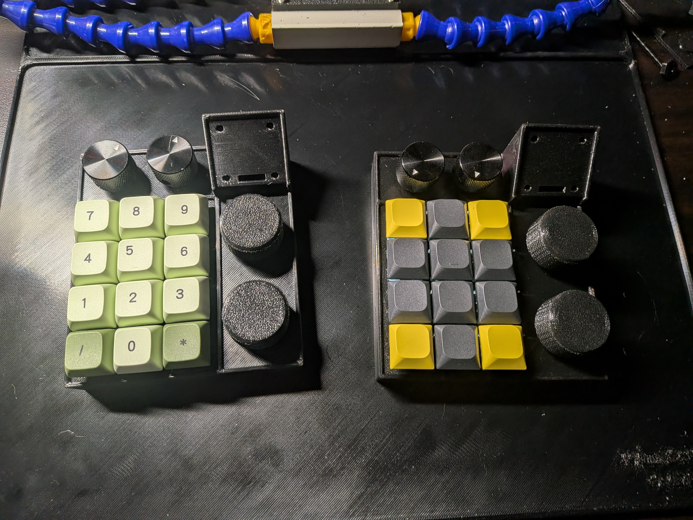
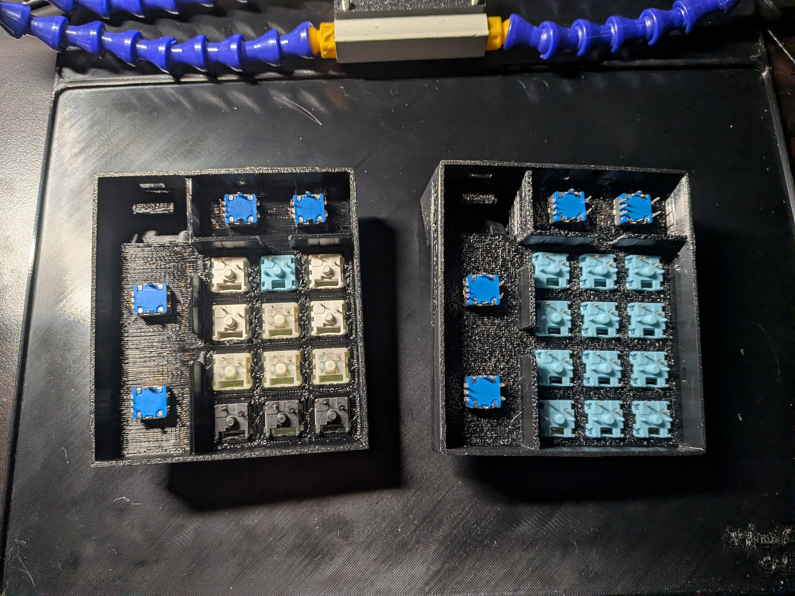
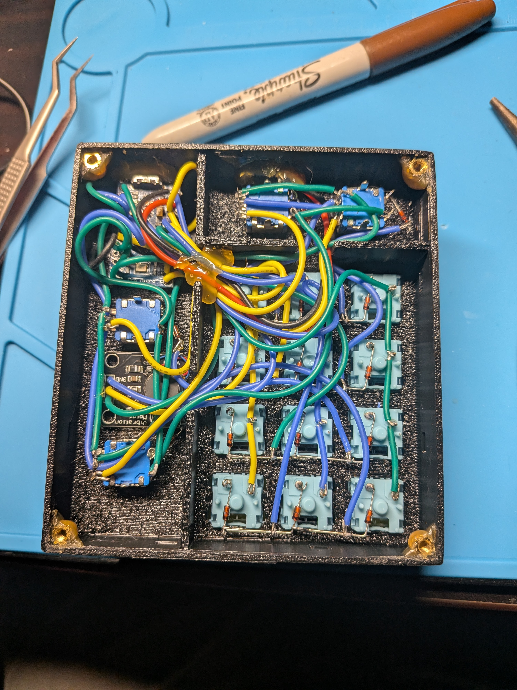
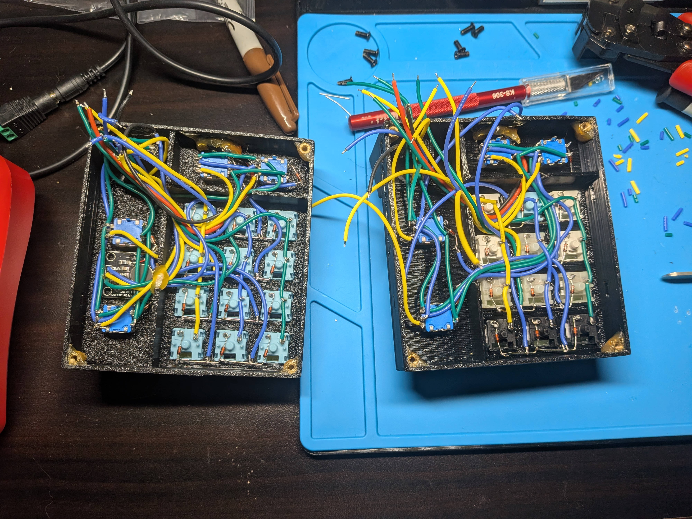
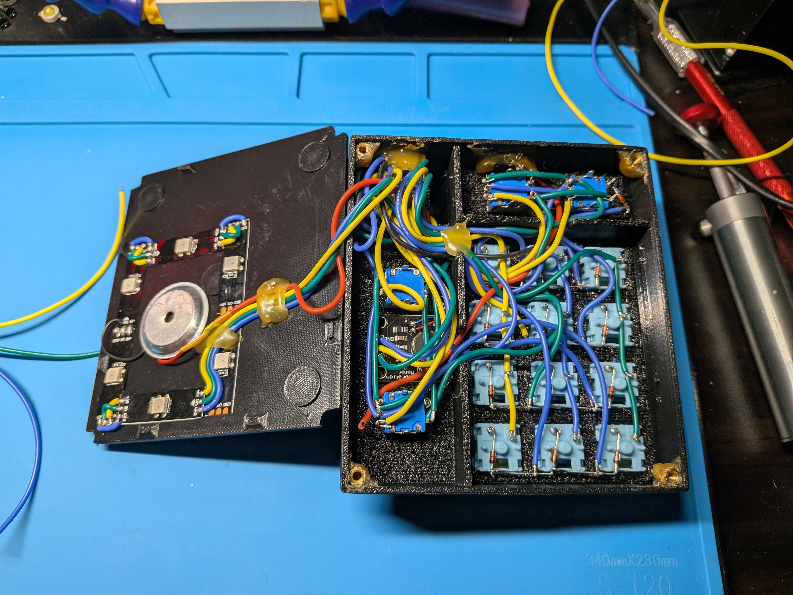
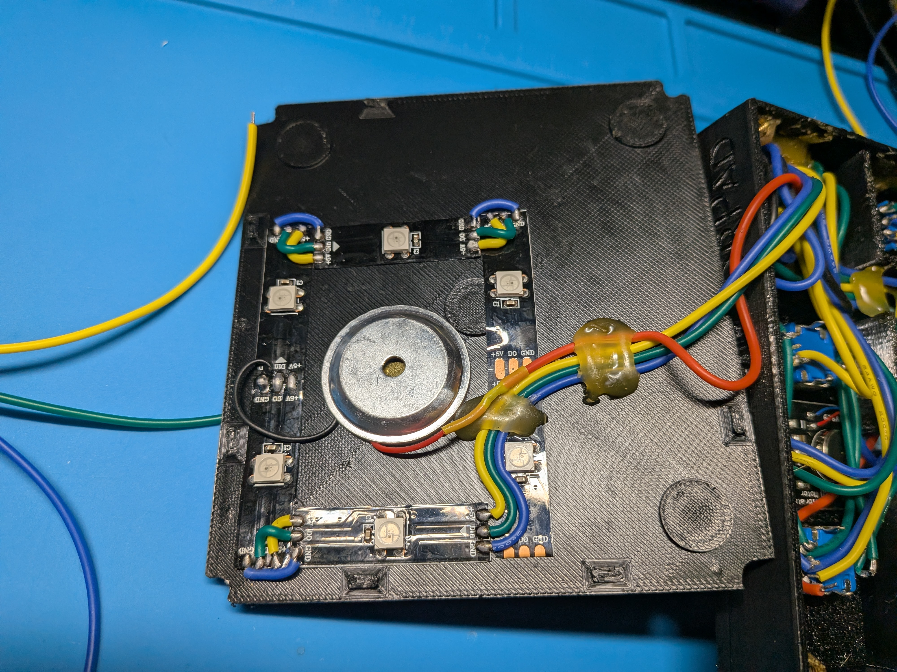

# ViktorPad



Custom 4x4 Macropad with Rotary Encoder and an OLED screen. Fully design by me.

To view the whole case: [viewstl](https://www.viewstl.com/)

## Hardware

1. RP2040 Zero
2. EC11 Rotary Encoder x4 with Knobs
3. OLED 0.96 inch 128x64 i2C

## Getting Started

Refer `rp2040_zero_pinout.jpg`for pinout.

### Guide

This guide assumed you are already follow root `README.md`, specifically these:

1. Setup QMK and clone the repository
2. Setup VS Code for C development
3. Create symbolic link between this repository and QMK/Vial repository

The keyboard will be working on is in this directory `<path-to-qmk-repository>/keyboards/saifymatteo/viktorpad/firmware`.

### Compiles

To compile keyboard and keymap:

```bash
qmk compile -kb saifymatteo/viktorpad/firmware -km vial_matteo
```

Note:

- `-kb` is `saifymatteo/viktorpad/firmware` keyboard config
- `-km` is `vial_matteo` keyboard mapping

### Flashing

To flash, simply drag-and-drop for RP2040.

Start flashing by shorting RUN and GND pin 2 times.

Once done, you can proceed to use drag-and-drop the `saifymatteo_viktorpad_firmware_vial_matteo.uf2` file to the RP2040 drive.

Note:

- You need to flash both side with the same `.uf2` file
- Communication between each side will be automatic once flashed

## VIAL

Alternative to remap your keymap, no need to reflash everytime want to change keymap.

Clone [vial-qmk](https://github.com/vial-kb/vial-qmk) to get started.

Creating the flash file for VIAL enabled are similar with QMK, the difference is that VIAL use `make` instead `qmk compile`

Ensure working directory in `vial-qmk` directory.

Run this to compile to `.uf2` file

```bash
make saifymatteo/viktorpad/firmware:vial_matteo
```

### VIAL Flashing

Please see [QMK flashing](#flashing)

## Images

<details>
<summary>unsoldered - inside</summary>


</details>
<details>
<summary>soldered - inside</summary>


</details>
<details>
<summary>partial soldered - inside</summary>


</details>
<details>
<summary>full soldered - inside</summary>


</details>
<details>
<summary>close-up backplate</summary>


</details>
